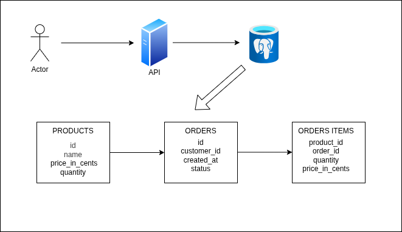

# Golang
This explains the devops flow.

# Tech Stack
## Development 
   1. React Js
   2. Golang

## Operations
### Deployment 
   1. Github Actions - CI
   2. Argo CD        - CD
   3. Helm Charts / Operators
   4. GKE            - Google Kubernetes Engine on GCP
   5. Ansible        - Conf Management
   6. Terraform      - IaaC

### Logging
   1. Prometheus

### Monitoring
   1. Grafana

# Getting Started 
* Golang Official Documentation : https://go.dev/doc/tutorial/getting-started

# Mission
* Design a public API for an ecom startup that should be readable to serve our first buyers.
* It should have the capability to scale later on.

# THE TWELVE FACTORS 
   1. Codebase - One codebase tracked in revision control, many deploys.
   2. Dependencies - Explicitly declare and isolate dependencies.
   3. Config - Store config in the environment.
   4. Backing services - Treat backing services as attached resources.
   5. Build, release, run - Strictly separate build and run stages.
   6. Processes - Execute the app as one or more stateless processes.
   7. Port binding - Export services via port binding.
   8. Concurrency - Scale out via the process model.
   9. Disposability - Maximum robustness with fast startup and graceful shutdown.
   10. Dev/Prod Parity - Keep development, staging and production as similar as possible.
   11. Logs - Treat logs as event streams.
   12. Admin processes - Run admin/management tasks as one-off processes.
   

# HIGH LEVEL DIAGRAM
* Diagram for the application is as shown below :

# API HIGH LEVEL DESIGN
* Prefix with /v1
* What we're going to build:
   * GET /health
   * GET /products?name&limit=20&offset=0
   * POST /orders
   